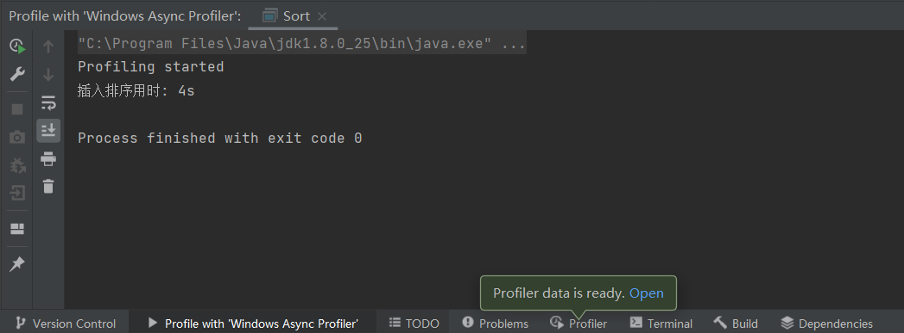
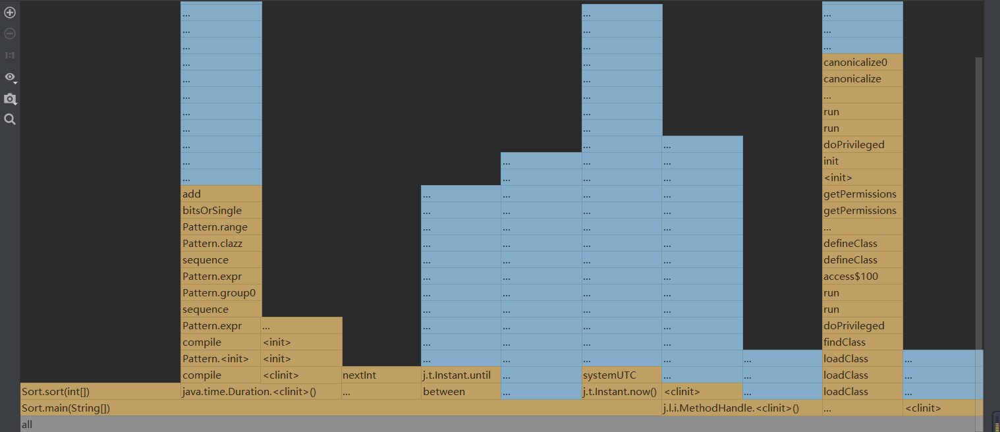
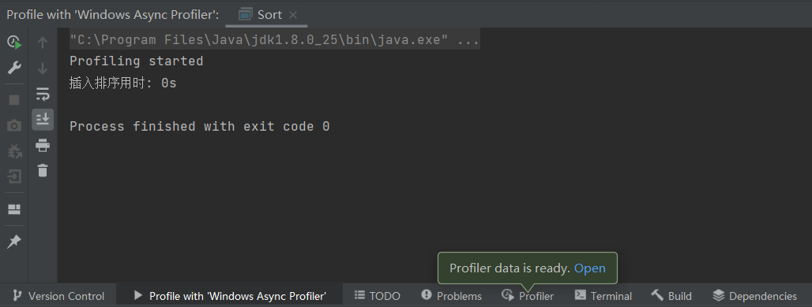
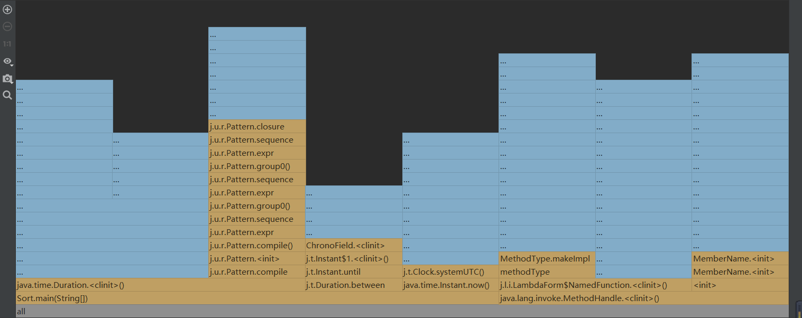
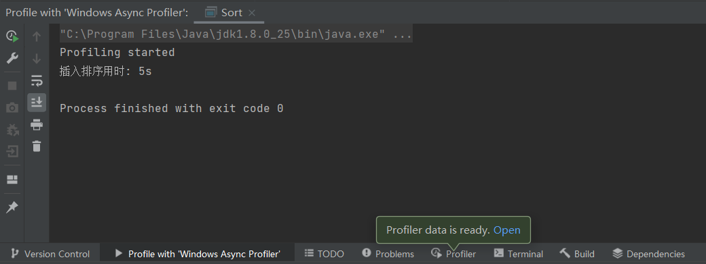
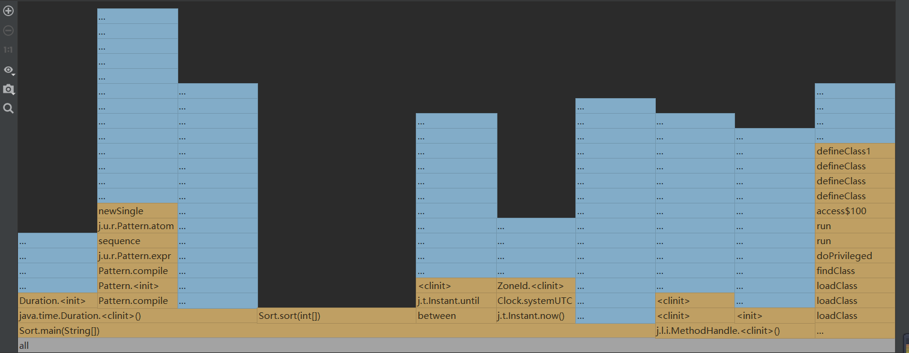

# 请使用Java的Profile工具探究插入排序中什么操作最耗时，并使用Markdown写出过程和结论。

## 1. 插入排序的代码
用于实现插入排序的代码如下：

    public static void sort(int[] arr) {
        if (arr.length <= 1) return;

        for (int i = 1; i < arr.length; ++i) {
            int val = arr[i];
            int j = i - 1;
            // 查找插入的位置
            for (; j >= 0; --j) {
                if (arr[j] > val) {
                    arr[j + 1] = arr[j];        // 数据移动
                } else {
                    break;
                }
            }
            arr[j + 1] = val;       // 插入数据
        }
    }

## 2. 对数组进行插入排序
### 2.1 无序数组
先生成一个长度为1000的随机整数数组，对其进行插入排序，对排序部分代码运行进行计时，结果如下：

使用Profiler生成的火焰图如下：

对于插入排序而言，当元素有序排列时，不需要进行元素移动，即程序不需要执行最里层的元素移动循环，大大减少了程序的运行时间，提高了程序的运行效率；

但当元素无序排列时，需要多次进行元素移动，即程序需要多次执行第二层元素移动循环，这会增加程序的时间复杂度。

### 2.2 顺序数组与倒序数组
为验证上述猜想，现先后生成一个长度为1000的顺序整数数组和一个长度为1000的倒序整数数组，分别对其进行插入排序，并对排序部分代码运行进行计时，结果如下：

**顺序数组**的排序用时：

使用Profiler生成的火焰图如下：

由排序用时结果和火焰图可以看出，当数组顺序时，插入排序的方法Sort运行速度非常快，耗时很少。

**倒序数组**的排序用时：

使用Profiler生成的火焰图如下：

由排序用时结果和火焰图可以看出，当数组倒序时，插入排序的方法Sort运行速度比较慢，耗时较多。

## 结论
`插入排序过程中，元素的移动操作会影响排序耗时。`

如果要排序的数组已经顺序，就只需要比较元素的大小，而不需要移动任何元素，这种情况是最好的，程序运行耗时最少。

但是如果要排序的数组是倒序的，在比较元素大小的基础上，每次插入都相当于在数组的第一个位置插入新的数据，所以需要移动大量元素，这种情况是最坏的，程序运行耗时最多。